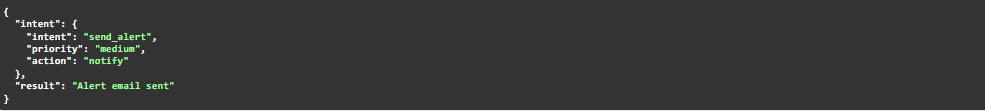
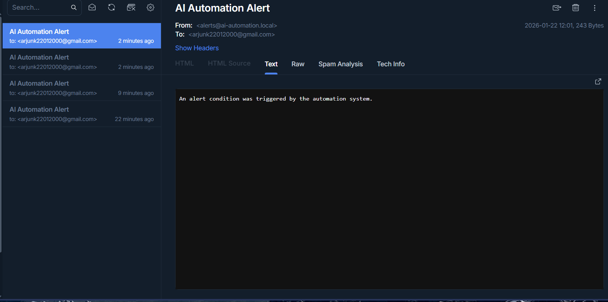

# AI Automation Control & Monitoring System

An AI-powered backend system that interprets user commands, makes intelligent decisions, executes automated actions, and logs system activity in real time.

## Problem Statement

Modern systems often rely on manual checks, static scripts, or hardcoded rules to perform monitoring and operational tasks. These approaches are inflexible, error-prone, and do not scale well as systems grow.

## Solution

This project provides an AI-driven automation system that:
- Accepts natural-language commands
- Uses AI logic to determine intent and priority
- Executes appropriate automation actions
- Logs every decision and action for observability

The system is designed to be modular, extensible, and production-ready.

## System Workflow

The system follows a clean and predictable pipeline:

Input → AI Analysis → Decision → Action → Logging

Example:
- User sends a command: "Check system status"
- AI determines intent and priority
- Automation logic executes a system task
- The result is logged for monitoring and debugging

## Tech Stack

- Python
- FastAPI
- Pydantic
- Uvicorn
- Modular service-based architecture

## Project Structure

ai-automation-system/
├── app/
│   ├── api/          # API routes
│   ├── services/     # AI logic and automation
│   ├── models/       # Data schemas
│   ├── utils/        # Logging and helpers
│   └── main.py       # Application entry point
├── venv/
├── requirements.txt
└── README.md

## How to Run

1. Create and activate a virtual environment
2. Install dependencies:
   pip install -r requirements.txt
3. Start the server:
   uvicorn app.main:app --reload
4. Open Swagger UI:
   http://127.0.0.1:8000/docs

## Future Improvements

- Integrate real LLMs (OpenAI or local models)
- Add real system monitoring (ports, services)
- Implement alerting via Telegram or Email
- Add authentication and role-based access

## Screenshots

### Command Execution

### Email Alert

### Monitoring Metrics

### System Logs

